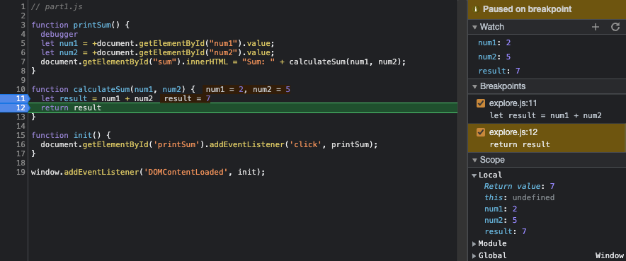

# DevTools Answers:
1. What was the bug? The program intended to add two inputed numbers, but these were read as strings, and thus concatenated. So when
the user would input "2" and "5", the result would be "25".

2. How did you fix it? I simply just used a Unary plus to attempt to convert the read data into a number if it isn't already (check MDN Web Docs for details). This way the two values are added like numbers.

